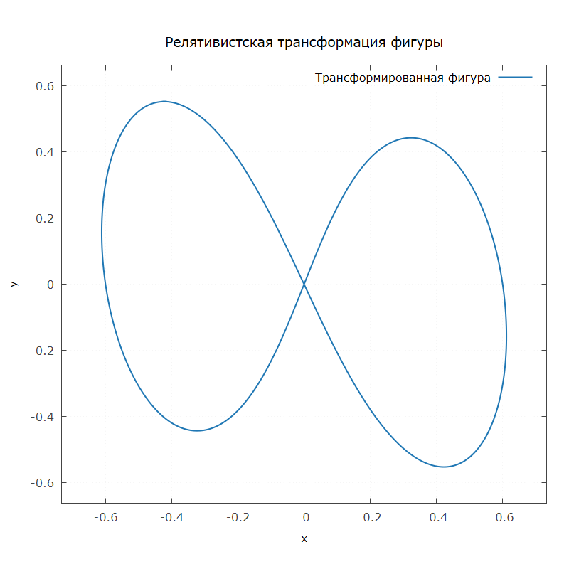

# Relativistic Curve Visualization

Визуализация релятивистского сокращения длины (лоренцево сокращение) для параметрической кривой при движении с околосветовой скоростью.



## Сборка и запуск

Требования:
- C++17-совместимый компилятор 
- Установленный `gnuplot`

```bash
g++ -std=c++17 -Iinclude src/*.cpp -o relativistic
./relativistic
